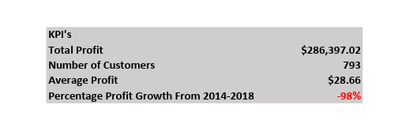
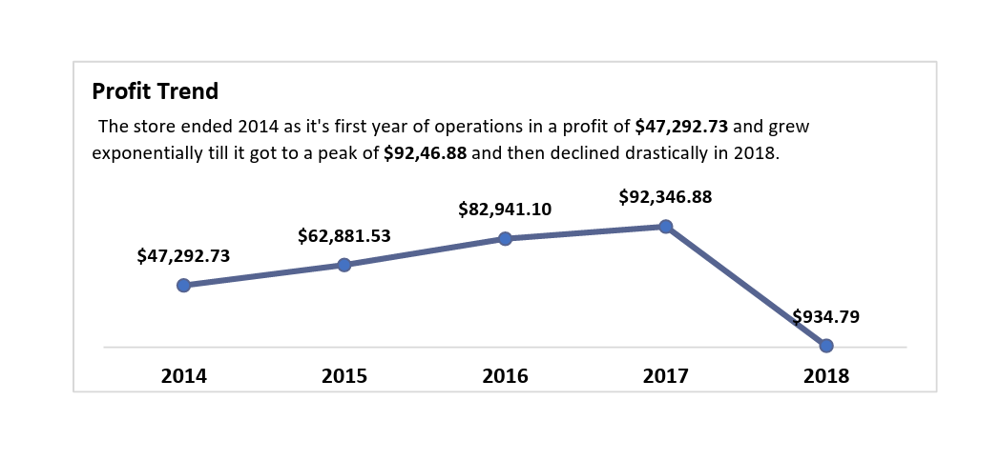
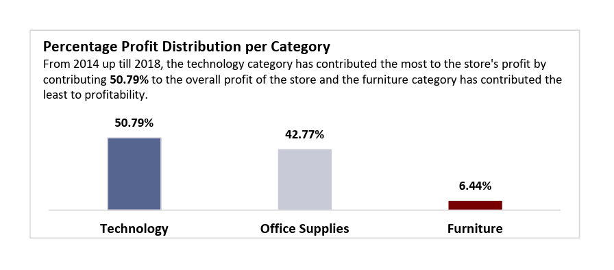
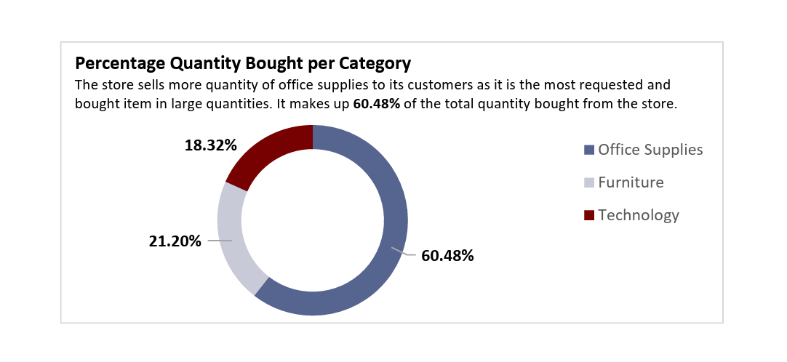
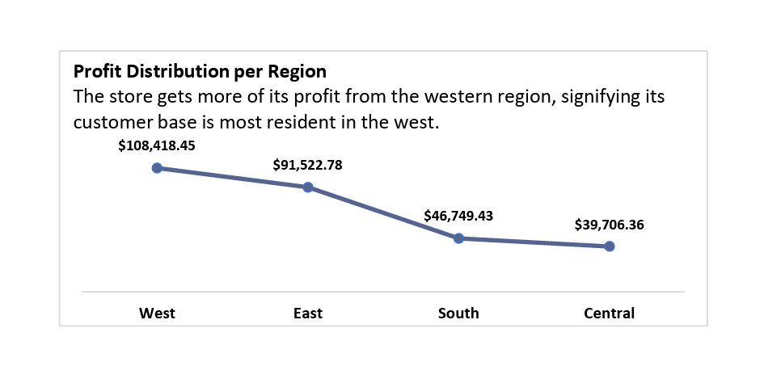
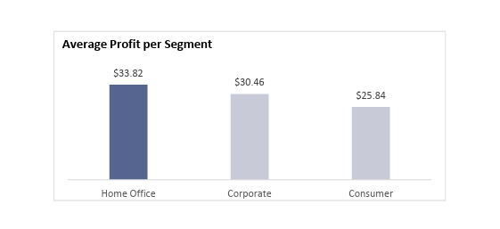

# Excel_Superstore_Project
## INTRODUCTION
This project looks at the analysis of a US superstore whose objective is to look at the line of their profits to see how they have performed over the years. In this analysis, thorough research was done regarding the store's profitability across various aspects of the store such as its segments, categories, region, and years. The store aims to see how it has performed profit-wise across each of these aspects.
## Skills Demonstrated
- Data manipulation
- Basic and advanced Excel functions
- Use of pivot tables
- Data visualisation
## Objective
To analyse the store's performance, several questions were asked which included:
- What is the profit trend across the 4 years of operation
- What is the percentage distribution of profit for each category
- What is the percentage distribution of quantity bought per category
- What is the profit distribution through the regions of operation
- What is the average profit per segment
## KPI

Above is the key performance index for the store, they were calculated as follows:
- Total Profit; The total profit from 2014-2018 was calculated using the **SUM** function to add up all the values in the profit column.
- Number of Customers: To get the number of customers that use our store, the **COUNT** and **UNIQUE** function was used to count distinct values in the customer id column.
- Average Profit: The **AVERAGE** function was used to calculate the average profit from 2014 to 2018
- Percentage Profit Growth From 2014 to 2018: To get the percentage profit growth, the total profit from the first year of operation which was 2014 and the current year which is 2018 was calculated using the **SUMIF** function and then we subtracted the total profit for the current year 2018 from the first year of operation 2014 and then divided it by the total profit from the first year and multiply it by 100.
## Objective Answers
## Profit Trend

The first year of operation of the store ended with a profit and increased till it got to its peak in the year 2017 where the store made a profit of **$92,346.22** but then saw a sharp decline in profit made as it progressed into 2018. We conducted further analysis to see other segments of profitability.
## Percentage Distribution of Profit per Category

Amongst all of the store's categories, the **Furniture** category contributed the least to the store's profit but the **Technology** category contributed the most to the store's profit through 4 years of operation. This insight can help guide the store to stock up on more technological category equipment to ensure profitability in the coming years.
## Percentage Quantity Bought per Category

**Office supplies** were bought in large quantities compared to other categories, which contributed to the **42.77%** of profitability of the store. Since office supplies are bought in larger quantities, it is advisable for the store to sell its office supplies wholesale to increase its profitability.
## Profit Distribution per Region

The store has made most of its profit from sales in the **West**, this region is the store's most active purchasing customer. The store should aim its advertisement towards the western region of the country for it to see increased profitability.
## Average Profit per Segment

The average profit provided by the **Home office** segment was the peak at **$33.82** per sale, this signifies a higher purchasing power from the home office segment.

## CONCLUSION
The store should aim its marketing and advertisement toward the **WESTERN** region of the country targeting **HOME OFFICE** buyers, and should also increase its **TECHNOLOGICAL** category of the store for increased profitability. This would put the store at increased profit each year. 
